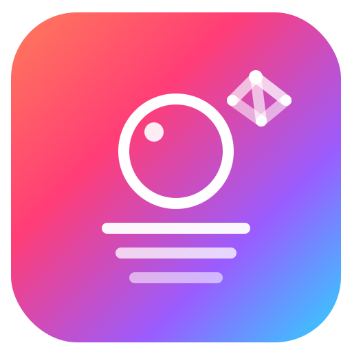

# CaptionPilot

<div align="center">
  
  
  <h3>AI-Powered Social Media Automation</h3>
  <p>Transform your Instagram and Pinterest presence with intelligent automation</p>
  
  [](https://reactjs.org/)
  [](https://www.typescriptlang.org/)
  [](https://tauri.app/)
  [](https://vitejs.dev/)
</div>

## 🚀 Overview

**CaptionPilot** is a cutting-edge desktop application that revolutionizes social media management through AI-powered automation. Create, schedule, and publish stunning content across Instagram and Pinterest with intelligent features that save time and maximize engagement.

### ✨ Key Features

- 🤖 **AI-Generated Captions** - Create engaging, platform-specific captions using advanced AI
- 📸 **Smart Image Processing** - Automatically optimize and format images for different platforms
- 📅 **Intelligent Scheduling** - Schedule posts with optimal timing for maximum engagement
- 📁 **Project Organization** - Organize content into projects with high-quality image storage
- 📊 **Analytics Dashboard** - Track performance with comprehensive insights
- 🔗 **Multi-Platform Support** - Seamlessly manage Instagram and Pinterest from one interface

## 🎯 What It Does

### Content Creation & Management
- **AI-Powered Caption Generation**: Generate engaging captions that match your brand voice and tone
- **Smart Image Optimization**: Automatically compress, resize, and format images for optimal platform performance
- **Project-Based Organization**: Organize your content into projects with unlimited high-quality image storage
- **Format-Specific Processing**: Support for Instagram (1:1, 4:5, 16:9) and Pinterest formats

### Automation & Scheduling
- **Intelligent Post Scheduling**: Schedule content across multiple platforms with optimal timing
- **Automated Publishing**: Direct integration with Instagram and Pinterest APIs for seamless posting
- **Content Queuing**: Build and manage content queues for consistent posting
- **Smart Timing Optimization**: AI-driven recommendations for best posting times

### Analytics & Insights
- **Performance Tracking**: Monitor engagement metrics across all platforms
- **Content Analytics**: Understand which content performs best
- **Scheduling Insights**: Optimize your posting schedule based on performance data
- **Project Metrics**: Track the success of different content projects

## 🛠️ Technology Stack

- **Frontend**: React 19.1.1 with TypeScript
- **Desktop Framework**: Tauri 2.8.0 (Rust-based)
- **Build Tool**: Vite 7.1.2
- **UI Framework**: Material-UI (MUI) 7.3.1
- **State Management**: React Hooks & Context
- **Database**: IndexedDB for local storage
- **Image Processing**: HTML5 Canvas API
- **AI Integration**: Custom AI services for caption generation

## 📦 Installation

### Prerequisites
- Node.js 18+ 
- Rust 1.70+ (for Tauri)
- Git

### Development Setup

1. **Clone the repository**
   ```bash
   git clone https://github.com/yourusername/inst-automation.git
   cd inst-automation
   ```

2. **Install dependencies**
   ```bash
   npm install
   ```

3. **Install Tauri CLI** (if not already installed)
   ```bash
   npm install -g @tauri-apps/cli
   ```

4. **Run in development mode**
   ```bash
   npm run tauri:dev
   ```

### Building for Production

```bash
# Build the application
npm run tauri:build

# The built application will be in src-tauri/target/release/
```

## 🎨 Features in Detail

### 🤖 AI-Powered Content Generation
- **Brand Voice Recognition**: AI learns your unique tone and style
- **Platform Optimization**: Captions optimized for Instagram vs Pinterest
- **Hashtag Intelligence**: Smart hashtag suggestions based on content
- **Engagement Optimization**: Captions designed to maximize interaction

### 📸 Smart Image Processing
- **Automatic Compression**: Intelligent compression that maintains quality
- **Format Conversion**: Seamless conversion between different aspect ratios
- **Quality Preservation**: High-quality storage for project images
- **Batch Processing**: Process multiple images simultaneously

### 📅 Advanced Scheduling
- **Multi-Platform Sync**: Coordinate posting across Instagram and Pinterest
- **Time Zone Management**: Automatic time zone handling
- **Content Queuing**: Build and manage posting schedules
- **Smart Timing**: AI-recommended optimal posting times

### 📁 Project Management
- **Unlimited Storage**: Store high-quality images without compression
- **Organized Workflow**: Group related content into projects
- **Version Control**: Track changes and iterations
- **Collaboration Ready**: Share projects with team members

## 🔧 Configuration

### Instagram API Setup
1. Create a Facebook Developer account
2. Set up an Instagram Business account
3. Configure Instagram Graph API
4. Add your credentials to the application

### Pinterest API Setup
1. Create a Pinterest Developer account
2. Set up Pinterest API access
3. Configure OAuth credentials
4. Add your credentials to the application

### AI Services Configuration
- Configure AI service endpoints in settings
- Set up brand voice preferences
- Customize content generation parameters

## 📱 Usage

### Getting Started
1. **Launch the application**
2. **Connect your social media accounts** (Instagram & Pinterest)
3. **Create your first project** and upload images
4. **Generate AI captions** for your content
5. **Schedule and publish** your posts

### Workflow
1. **Create Projects**: Organize your content into themed projects
2. **Upload Images**: Add high-quality images to your projects
3. **Generate Content**: Use AI to create engaging captions
4. **Schedule Posts**: Set up automated posting schedules
5. **Monitor Performance**: Track engagement and optimize strategy

## 🔒 Privacy & Security

- **Local Data Storage**: All data stored locally on your device
- **Secure API Integration**: Encrypted communication with social platforms
- **No Data Selling**: We never sell or share your personal data
- **GDPR Compliant**: Full compliance with data protection regulations
- **Open Source**: Transparent codebase for security auditing

## 🤝 Contributing

We welcome contributions! Please see our [Contributing Guidelines](CONTRIBUTING.md) for details.

### Development Workflow
1. Fork the repository
2. Create a feature branch (`git checkout -b feature/amazing-feature`)
3. Commit your changes (`git commit -m 'Add amazing feature'`)
4. Push to the branch (`git push origin feature/amazing-feature`)
5. Open a Pull Request

## 📄 License

This project is licensed under the MIT License - see the [LICENSE](LICENSE) file for details.

## 🆘 Support

- **Documentation**: [Full Documentation](docs/)
- **Issues**: [GitHub Issues](https://github.com/yourusername/inst-automation/issues)
- **Discussions**: [GitHub Discussions](https://github.com/yourusername/inst-automation/discussions)
- **Email**: support@instautomation.com

## 🗺️ Roadmap

### Upcoming Features
- [ ] **TikTok Integration** - Expand to TikTok automation
- [ ] **Advanced Analytics** - Enhanced performance insights
- [ ] **Team Collaboration** - Multi-user project management
- [ ] **Content Templates** - Pre-built content templates
- [ ] **API Access** - Third-party integrations
- [ ] **Mobile App** - Companion mobile application

### Version History
- **v1.0.0** - Initial release with Instagram and Pinterest support
- **v1.1.0** - AI caption generation
- **v1.2.0** - Advanced scheduling features
- **v1.3.0** - Project management system
- **v1.4.0** - Analytics dashboard

## 🙏 Acknowledgments

- **React Team** - For the amazing frontend framework
- **Tauri Team** - For the lightweight desktop framework
- **Material-UI Team** - For the beautiful component library
- **Open Source Community** - For the incredible tools and libraries

---

<div align="center">
  <p>Made with ❤️ by the Yevhen Butko</p>
  <p>
    <a href="https://github.com/yourusername/inst-automation">⭐ Star us on GitHub</a> •
    <a href="https://twitter.com/instautomation">🐦 Follow us on Twitter</a> •
    <a href="mailto:hello@instautomation.com">📧 Contact us</a>
  </p>
</div>